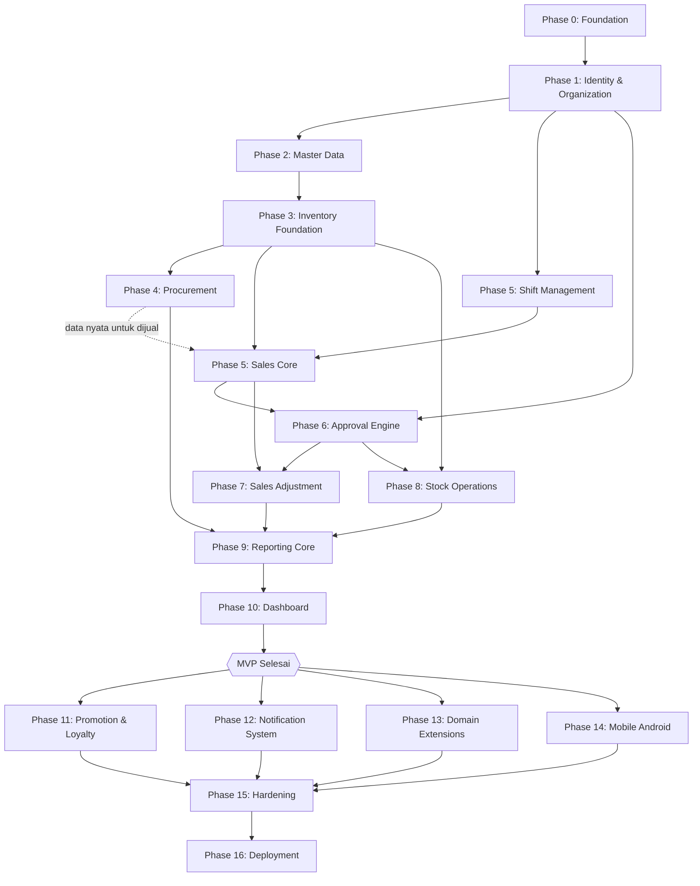

# Development Roadmap — POS

> Dokumen ini adalah **GPS eksekusi development** untuk project POS. Dokumentasi [`business/`](business/README.md) dan [`technical/`](technical/README.md) menjawab *"sistem harus seperti apa?"* — dokumen ini menjawab *"developer harus mengerjakan apa dulu, lalu apa, sampai project selesai?"*.

Dokumen ini **tidak menduplikasi** isi dokumentasi business/technical. Setiap feature hanya mereferensikan dokumen sumber yang wajib dibaca sebelum implementasi.

---

## 1. Purpose

`development-roadmap.md` digunakan sebagai **satu-satunya titik masuk harian** bagi developer (solo maupun tim kecil) untuk mengetahui:

1. Apa yang sudah selesai, apa yang sedang dikerjakan, apa berikutnya.
2. Dokumen business & technical mana yang wajib dibaca sebelum mulai menulis kode untuk suatu feature.
3. Batasan scope suatu feature (agar tidak over-engineering atau salah urutan).
4. Kriteria konkret suatu feature dianggap selesai (Definition of Done).
5. Bagaimana feature tersebut masuk ke Git workflow (branch, commit, PR).

**Cara memakai dokumen ini:** buka bagian [16. Development Order](#16-development-order), cari baris pertama dengan status `Not Started`/`In Progress`, lompat ke section Feature yang bersangkutan, ikuti checklist-nya dari atas ke bawah.

---

## 2. Development Principles

| Prinsip | Penjelasan |
|---|---|
| **Feature-driven development** | Unit kerja utama adalah *business capability* (mis. "Sales Core Transaction"), bukan file/class/endpoint individual. |
| **Vertical feature delivery** | Sebuah feature dikerjakan Backend → Frontend → Testing sampai *usable*, bukan menyelesaikan seluruh backend project baru menyentuh frontend. |
| **Dependency-aware development** | Feature dikerjakan sesuai urutan dependency nyata (data, otorisasi, alur bisnis) — lihat [15. Dependency & Ordering](#15-dependency--ordering). |
| **Backend + Frontend integration** | Feature baru dianggap selesai jika frontend benar-benar mengonsumsi API yang dibangun, bukan hanya API yang "ada". |
| **Testing as part of feature completion** | Test bukan fase terpisah di akhir project — setiap feature membawa test-nya sendiri sebagai bagian dari Definition of Done. |
| **Incremental delivery** | Sistem harus dapat di-demo secara bertahap sejak MVP selesai (lihat [14. MVP / Milestone](#14-mvp--milestone)), bukan hanya di akhir seluruh roadmap. |
| **Git feature branch workflow** | Satu feature = satu branch (`feature/<nama-feature>`), bukan satu branch per file/function. |
| **Pull Request workflow** | Setiap feature branch berakhir sebagai Pull Request ke `main`, direview sebelum merge. |
| **Definition of Done eksplisit** | Setiap feature punya kriteria selesai yang konkret dan dapat diverifikasi, bukan "kelihatannya sudah jalan". |

### 2.1 Catatan Konsistensi & Resolusi Ambiguitas Dokumentasi

Selama menyusun roadmap ini, ditemukan beberapa area di mana dokumentasi business/technical memerlukan keputusan eksplisit agar urutan implementasi konsisten. Keputusan berikut **mengikat** untuk seluruh roadmap:

1. **Notifikasi real-time vs Approval MVP.** [`notifications.md`](business/notifications.md) mendeskripsikan notifikasi push per kejadian, namun modul Notification generik (event-driven, multi-kanal) dijadwalkan Post-MVP (Fase 10). **Resolusi:** pada MVP, kebutuhan approval tetap terpenuhi secara fungsional melalui endpoint `GET /approval-requests?status=pending` (bagian dari Approval Workflow Engine, Fase 6) yang di-*poll* oleh UI Supervisor/Branch Manager — bukan push notification. Ini konsisten dengan [`functional-requirements.md`](business/functional-requirements.md) yang menandai sebagian besar item notifikasi granular sebagai *Should Have*, sedangkan mekanisme approval generik sendiri *Must Have*.
2. **Kebijakan "izinkan stok minus" per cabang** (BRULE-ST-01 pada [`business-rules.md`](business/business-rules.md)) disebutkan sebagai pengecualian, namun [`database-design.md`](technical/database-design.md) belum mendefinisikan kolom konfigurasinya secara eksplisit. **Resolusi:** ditambahkan sebagai task konkret pada Fase 3 (Inventory Foundation) — kolom `allow_negative_stock` pada tabel `branches`.
3. **Mobile offline-first** (BR-02, FR-SL-08) — [`business-requirements.md`](business/business-requirements.md) menyebutnya kebutuhan bisnis inti, namun [`functional-requirements.md`](business/functional-requirements.md) menandai FR-SL-08 sebagai *Should Have* (bukan *Must Have*). **Resolusi:** Mobile Android (termasuk offline sync) ditempatkan sebagai feature Post-MVP awal (Fase 12) — bukan dihilangkan, namun tidak memblokir MVP berbasis web yang sudah mendemonstrasikan seluruh alur bisnis inti terlebih dahulu, sejalan dengan prioritas MoSCoW pada dokumen sumber.
4. **Skala deployment bertahap.** [`deployment-architecture.md`](technical/deployment-architecture.md) mendefinisikan 3 tahap skala infrastruktur. **Resolusi:** Fase 14 (Deployment) roadmap ini menargetkan Tahap 1/2 (cukup untuk portfolio production-ready yang dapat didemonstrasikan). Tahap 3 (auto-scaling, read replica) dicatat sebagai *extension point* pasca-launch, bukan bagian wajib Definition of Done awal.

---

## 3. Development Phases

Diagram berikut merangkum urutan fase berdasarkan dependency nyata (data, otorisasi, alur bisnis) — bukan urutan file dokumentasi:



Setiap fase pada bagian selanjutnya mengikuti struktur:

```text
Phase
├── Objective
├── Why this phase comes here
├── Dependencies
├── Features
└── Exit Criteria
```

---

### Phase 0 — Project Foundation

**Objective:** Menyediakan kerangka kerja teknis (repository, container, pipeline dasar) agar seluruh feature berikutnya dapat dibangun di atas fondasi yang konsisten.

**Why this phase comes here:** Tidak ada business capability yang dapat dibangun tanpa environment yang berjalan — ini murni prasyarat teknis, sesuai struktur folder pada [`folder-structure.md`](technical/folder-structure.md) dan containerization pada [`docker-architecture.md`](technical/docker-architecture.md).

**Dependencies:** Tidak ada.

**Features:** [Project Foundation & Development Environment](#feature-project-foundation--development-environment)

**Exit Criteria:** Developer baru dapat menjalankan `docker compose up` dan mendapatkan backend, frontend, database, redis berjalan lokal dalam satu perintah; CI dasar (lint + test) aktif di setiap Pull Request.

---

### Phase 1 — Identity & Organization Foundation

**Objective:** Membangun struktur organisasi dasar (cabang), otentikasi, dan otorisasi — prasyarat mutlak bagi seluruh feature lain karena hampir seluruh entitas transaksional terikat pada `branch_id` dan seluruh endpoint memerlukan pengguna terotentikasi & terotorisasi.

**Why this phase comes here:** [`authorization-design.md`](technical/authorization-design.md) mensyaratkan `BranchScope` yang membaca `branch_id` milik pengguna login — artinya struktur cabang, otentikasi, dan otorisasi adalah satu rantai dependency yang tidak dapat dipisah urutannya.

**Dependencies:** Phase 0.

**Features:**
- [Organization Structure (Branch & Outlet Management)](#feature-organization-structure-branch--outlet-management)
- [Authentication](#feature-authentication)
- [Authorization (RBAC & Branch Data Scoping)](#feature-authorization-rbac--branch-data-scoping)
- [Employee Management](#feature-employee-management)

**Exit Criteria:** Pengguna dapat login, mendapatkan token, dan seluruh request API secara otomatis dibatasi sesuai cabang & permission miliknya (data scoping aktif dan teruji).

---

### Phase 2 — Master Data

**Objective:** Menyediakan data referensi inti (produk, pelanggan, supplier) yang menjadi fondasi seluruh transaksi.

**Why this phase comes here:** Sesuai [`master-data.md`](business/master-data.md), tidak ada transaksi (pembelian, penjualan, stok) yang dapat dibuat tanpa data master produk/pelanggan/supplier terlebih dahulu ada.

**Dependencies:** Phase 1 (Authorization untuk endpoint CRUD terproteksi).

**Features:**
- [Product Catalog Management](#feature-product-catalog-management)
- [Customer & Supplier Management](#feature-customer--supplier-management)

**Exit Criteria:** HO Admin dapat membuat produk (dengan satuan & kategori), pelanggan, dan supplier melalui UI, dan data tersebut dapat dicari/digunakan modul lain.

---

### Phase 3 — Inventory Foundation

**Objective:** Membangun mesin pergerakan stok (kartu stok, stok ringkas per cabang, tracking batch/expired) sebagai satu-satunya titik masuk perubahan stok di seluruh sistem.

**Why this phase comes here:** Sesuai [`module-design.md`](technical/module-design.md#6-modul-inventory-stok), `StockService` harus ada **sebelum** Procurement maupun Sales dibangun, karena keduanya memanggil service yang sama untuk menambah/mengurangi stok.

**Dependencies:** Phase 2 (Product Catalog).

**Features:**
- [Inventory Foundation (Stock Ledger & FEFO)](#feature-inventory-foundation-stock-ledger--fefo)

**Exit Criteria:** `StockService` dapat menambah/mengurangi stok secara atomic dengan locking, mencatat kartu stok, dan mengalokasikan batch sesuai FEFO — teruji lewat operasi manual (belum ada UI transaksi nyata).

---

### Phase 4 — Procurement

**Objective:** Memungkinkan stok masuk ke sistem melalui alur bisnis nyata (Purchase Order → Goods Receipt), bukan hanya seed manual.

**Why this phase comes here:** Sesuai alur pada [`business-flow.md`](business/business-flow.md#13-alur-umum-manajemen-stok), stok masuk mendahului stok keluar (penjualan) — Procurement dibangun sebelum Sales Core agar data stok yang digunakan Sales adalah hasil alur bisnis riil, bukan data suntikan.

**Dependencies:** Phase 2 (Supplier, Product), Phase 3 (Inventory Foundation).

**Features:**
- [Procurement (Purchase Order & Goods Receipt)](#feature-procurement-purchase-order--goods-receipt)

**Exit Criteria:** Branch Manager dapat membuat PO, mencatat penerimaan barang (termasuk sebagian), dan stok otomatis bertambah serta tercatat di kartu stok.

---

### Phase 5 — Sales Core

**Objective:** Mengaktifkan fungsi inti sebuah POS: kasir dapat membuka shift dan memproses transaksi penjualan dasar.

**Why this phase comes here:** BRULE-TX-01 pada [`business-rules.md`](business/business-rules.md) mensyaratkan shift aktif sebelum transaksi dibuat — Shift Management karena itu mendahului Sales Core Transaction dalam fase yang sama.

**Dependencies:** Phase 1 (Employee, Branch), Phase 3 (Inventory Foundation). *Dependency praktis:* Phase 4 (agar ada stok nyata untuk didemonstrasikan, meski secara teknis stok juga dapat diseed melalui Stock Opname).

**Features:**
- [Cashier Shift Management](#feature-cashier-shift-management)
- [Sales Core Transaction (POS Checkout)](#feature-sales-core-transaction-pos-checkout)

**Exit Criteria:** Kasir dapat membuka shift, melakukan transaksi multi-item dengan split payment, stok berkurang otomatis, struk/ringkasan transaksi tampil, dan shift dapat ditutup dengan rekonsiliasi kas.

---

### Phase 6 — Approval & Sales Control

**Objective:** Menegakkan kontrol anti-fraud (void, retur, diskon manual) melalui mesin approval generik.

**Why this phase comes here:** Approval Engine dibangun generik (polymorphic) sesuai [`module-design.md`](technical/module-design.md#7-modul-approval), sehingga baru bermakna untuk didemonstrasikan setelah ada konsumen nyata (Sales Core, Phase 5) yang membutuhkannya.

**Dependencies:** Phase 1 (Authorization, role hierarchy), Phase 5 (Sales Core sebagai konsumen pertama).

**Features:**
- [Approval Workflow Engine](#feature-approval-workflow-engine)
- [Sales Adjustment (Void, Return, Manual Discount)](#feature-sales-adjustment-void-return-manual-discount)

**Exit Criteria:** Kasir dapat mengajukan void/retur/diskon manual di atas threshold, Supervisor menerima daftar pending approval dan dapat menyetujui/menolak, larangan self-approval teruji, eskalasi otomatis teruji.

---

### Phase 7 — Stock Control

**Objective:** Melengkapi siklus hidup stok dengan operasi lanjutan: transfer antar cabang, stok opname, dan penyesuaian manual.

**Why this phase comes here:** Membutuhkan Inventory Foundation (Phase 3) untuk mekanisme dasar, dan Approval Engine (Phase 6) karena penyesuaian stok & selisih opname signifikan wajib melalui approval (BRULE-ST-05).

**Dependencies:** Phase 3, Phase 6.

**Features:**
- [Stock Operations (Transfer, Opname, Adjustment)](#feature-stock-operations-transfer-opname-adjustment)

**Exit Criteria:** Transfer stok antar cabang dapat dilakukan end-to-end (kirim → terima), stok opname menghasilkan selisih otomatis dengan approval jika signifikan, penyesuaian manual selalu melalui approval.

---

### Phase 8 — Reporting & Insight

**Objective:** Mengubah data transaksional yang sudah terkumpul (Procurement, Sales, Stock) menjadi laporan dan dashboard yang bernilai bagi manajemen.

**Why this phase comes here:** [`reports.md`](business/reports.md) dan [`dashboard.md`](business/dashboard.md) secara logis membutuhkan **data transaksional nyata** untuk memiliki nilai — dibangun setelah modul-modul sumber data (Phase 4, 5, 7) berfungsi.

**Dependencies:** Phase 4, Phase 5, Phase 7.

**Features:**
- [Reporting Core (Sales, Stock, Cash Reconciliation)](#feature-reporting-core-sales-stock-cash-reconciliation)
- [Dashboard (Role-Based)](#feature-dashboard-role-based)

**Exit Criteria:** Owner/Branch Manager dapat melihat dashboard ringkasan sesuai role, dan laporan penjualan/stok/kas dapat difilter serta diekspor.

---

## MVP selesai di titik ini — lihat [14. MVP / Milestone](#14-mvp--milestone).

---

### Phase 9 — Retail Experience Enhancement (Post-MVP)

**Objective:** Melengkapi pengalaman retail dengan promo dan loyalitas pelanggan.

**Why this phase comes here:** Promo/loyalti membutuhkan Sales Core yang stabil (Phase 5) dan Customer Management (Phase 2) — bukan bagian dari rantai inti Procurement→Stock→Sales→Approval→Report yang membuktikan sistem berfungsi end-to-end, sehingga ditempatkan setelah MVP.

**Dependencies:** MVP (Phase 0–8).

**Features:** [Promotion & Loyalty](#feature-promotion--loyalty)

**Exit Criteria:** Promo diterapkan otomatis saat transaksi, poin loyalitas terakumulasi dan dapat ditukar.

---

### Phase 10 — Notification System (Post-MVP)

**Objective:** Menggantikan mekanisme polling manual (dipakai sejak MVP) dengan notifikasi proaktif multi-kanal.

**Why this phase comes here:** Notification Module bersifat cross-cutting dan bereaksi terhadap event yang di-dispatch modul lain ([`module-design.md`](technical/module-design.md#10-modul-notification)) — baru bisa dibangun penuh setelah sumber-sumber event (Approval, Stock, Shift) sudah ada sejak MVP.

**Dependencies:** Phase 6 (Approval events), Phase 7 (Stock events), Phase 5 (Shift events).

**Features:** [Notification System](#feature-notification-system)

**Exit Criteria:** Notifikasi in-app & email terkirim otomatis untuk approval pending, stok menipis, produk mendekati kadaluarsa, shift belum ditutup.

---

### Phase 11 — Domain Extensions (Post-MVP)

**Objective:** Mengaktifkan karakteristik khusus per domain bisnis (F&B, Apotek, Distributor) di atas fondasi generik yang sudah terbukti bekerja.

**Why this phase comes here:** Sesuai prinsip *modular monolith* pada [`system-architecture.md`](technical/system-architecture.md), ekstensi domain dibangun sebagai lapisan tambahan di atas Sales Core & Inventory Foundation yang sudah stabil — bukan dicampur ke dalam MVP generik agar MVP tetap fokus dan cepat dibuktikan.

**Dependencies:** Phase 5 (Sales Core), Phase 3 (Inventory Foundation untuk Apotek), Phase 2 (Customer untuk Distributor), Phase 6 (Approval untuk Distributor credit limit).

**Features:**
- [F&B Extension (Table, Open Bill, Kitchen Order)](#feature-fb-extension-table-open-bill-kitchen-order)
- [Apotek Extension (Prescription Validation)](#feature-apotek-extension-prescription-validation)
- [Distributor Extension (Tiered Pricing & Credit Sale)](#feature-distributor-extension-tiered-pricing--credit-sale)

**Exit Criteria:** Ketiga domain dapat didemonstrasikan sebagai *toggle* konfigurasi di atas Sales Core yang sama, tanpa mengubah struktur inti.

---

### Phase 12 — Mobile Android (Post-MVP)

**Objective:** Menghadirkan alur kasir inti di perangkat Android, termasuk dukungan offline-first.

**Why this phase comes here:** FR-SL-08 (offline sync) ditandai *Should Have* pada [`functional-requirements.md`](business/functional-requirements.md), dan API Sales Core perlu stabil terlebih dahulu (mengurangi risiko rework mobile akibat perubahan kontrak API yang sering terjadi di awal development).

**Dependencies:** Phase 1 (Authentication), Phase 5 (Sales Core API stabil), Phase 2 (Product search API).

**Features:** [Mobile Android — Authentication & Core Cashier Flow](#feature-mobile-android--authentication--core-cashier-flow)

**Exit Criteria:** Kasir dapat login, mencari produk, membuat transaksi di aplikasi Android, transaksi offline tersimpan lokal dan tersinkron otomatis saat online.

---

### Phase 13 — Production Hardening

**Objective:** Melakukan validasi menyeluruh dan menambal celah tersisa pada keamanan, observability, dan kesiapan pemulihan bencana — **bukan** memperkenalkan kontrol baru dari nol (sebagian besar sudah dibangun incremental di setiap feature sebelumnya).

**Why this phase comes here:** Hardening menyeluruh baru bermakna setelah permukaan fitur (attack surface, log sources) sudah lengkap — dilakukan setelah seluruh feature functional (MVP + Post-MVP) selesai.

**Dependencies:** Seluruh Phase 0–12.

**Features:**
- [Security Hardening](#feature-security-hardening)
- [Observability & Logging Hardening](#feature-observability--logging-hardening)
- [Backup & Disaster Recovery Readiness](#feature-backup--disaster-recovery-readiness)

**Exit Criteria:** Checklist keamanan [`security-design.md`](technical/security-design.md) tervalidasi seluruhnya, log terstruktur & retensi aktif, DR drill pertama berhasil dilakukan dengan RTO/RPO sesuai target [`backup-strategy.md`](technical/backup-strategy.md).

---

### Phase 14 — Deployment

**Objective:** Membawa sistem ke lingkungan production AWS EC2 yang dapat diakses publik dan didemonstrasikan.

**Why this phase comes here:** Deployment production dilakukan **setelah** hardening agar yang pertama kali live adalah versi yang sudah melalui validasi keamanan & observability, bukan versi mentah.

**Dependencies:** Phase 13.

**Features:** [CI/CD Pipeline & AWS Deployment](#feature-cicd-pipeline--aws-deployment)

**Exit Criteria:** Aplikasi dapat diakses via domain HTTPS production, deployment berikutnya berjalan otomatis melalui pipeline tanpa langkah manual, rollback dapat dilakukan dalam hitungan menit.

---

## 4. Feature: Project Foundation & Development Environment

### Objective
Menyediakan struktur repository, container development, dan pipeline CI dasar sebagai fondasi seluruh feature berikutnya.

### Business References
```text
- ../README.md (overview project & prinsip desain)
```

### Technical References
```text
- technical/README.md
- technical/system-architecture.md
- technical/folder-structure.md
- technical/docker-architecture.md
```

### Dependencies
```text
Depends on: (tidak ada)
```

### Backend Tasks
```md
- [ ] Inisialisasi project Laravel sesuai folder-structure.md
- [ ] Konfigurasi koneksi PostgreSQL & Redis (.env.example)
- [ ] Setup base Dockerfile (multi-stage) sesuai docker-architecture.md
- [ ] Setup docker-compose.dev.yml (nginx, app, postgres, redis)
- [ ] Konfigurasi dasar Monolog channel (application log)
- [ ] Endpoint /health dasar
```

### Frontend Tasks
```md
- [ ] Inisialisasi project Vue 3 + Vite + Tailwind sesuai folder-structure.md
- [ ] Setup struktur folder dasar (pages, components, stores, services)
- [ ] Konfigurasi axios base client (apiClient.js)
```

### Mobile Tasks
```text
Not applicable in this phase.
```

### Testing Tasks
```md
- [ ] Setup PHPUnit dasar (test database SQLite/PostgreSQL)
- [ ] Setup Vitest dasar untuk frontend
```

### Documentation Tasks
```md
- [ ] Update README.md dengan instruksi setup lokal (docker compose up)
```

### Definition of Done
```md
- [ ] `docker compose up` menjalankan backend, frontend, database, redis tanpa error
- [ ] GET /health mengembalikan status ok
- [ ] CI (lint + test kosong) berjalan hijau di setiap Pull Request
- [ ] Struktur folder sesuai folder-structure.md
- [ ] Ready for Pull Request
```

### Git
```text
Recommended branch:
feature/project-foundation
```
```bash
git commit -m "chore(setup): initialize backend and frontend project structure"
git commit -m "build(docker): configure development docker compose"
git commit -m "ci(github): add basic lint and test workflow"
```

---

## 5. Feature: Organization Structure (Branch & Outlet Management)

### Objective
Menyediakan struktur cabang (Head Office → Branch → Outlet) yang menjadi dasar data scoping seluruh sistem.

### Business References
```text
- business/README.md (bagian 3.1 Model Operasional)
- business/master-data.md (bagian 4 Cabang & Outlet)
```

### Technical References
```text
- technical/database-design.md (bagian 4.1)
- technical/erd.md (bagian 1)
```

### Dependencies
```text
Depends on:
- Project Foundation
```

### Backend Tasks
```md
- [ ] Migration tabel branches (dengan parent_id self-reference)
- [ ] Model Branch + relasi hierarki
- [ ] BranchRepository + interface
- [ ] BranchService (create, update, deactivate/soft-delete)
- [ ] API endpoint CRUD branches
- [ ] Validasi keunikan kode cabang
```

### Frontend Tasks
```md
- [ ] Halaman daftar cabang (HO Admin)
- [ ] Form create/edit cabang
- [ ] Tampilan hierarki cabang sederhana
```

### Mobile Tasks
```text
Not applicable in this phase.
```

### Testing Tasks
```md
- [ ] Unit test BranchService (validasi kode unik)
- [ ] Feature test endpoint branches CRUD
```

### Documentation Tasks
```md
- [ ] Update API documentation untuk endpoint branches
```

### Definition of Done
```md
- [ ] HO Admin dapat membuat, mengubah, menonaktifkan cabang
- [ ] Kode cabang unik tervalidasi di level aplikasi & database
- [ ] Tests pass
- [ ] Ready for Pull Request
```

### Git
```text
Recommended branch:
feature/organization-structure
```
```bash
git commit -m "feat(branch): implement branch and outlet management"
```

---

## 6. Feature: Authentication

### Objective
Memungkinkan pengguna login dan mendapatkan token akses sesuai [`authentication-design.md`](technical/authentication-design.md).

### Business References
```text
- business/role-permission.md (bagian 2 Daftar Role)
- business/functional-requirements.md (FR-AU-01)
```

### Technical References
```text
- technical/authentication-design.md
- technical/api-contract.md (bagian 2)
- technical/erd.md (bagian 6)
```

### Dependencies
```text
Depends on:
- Project Foundation
- Organization Structure (Branch)
```

### Backend Tasks
```md
- [ ] Migration tabel employees (dengan branch_id, password_hash)
- [ ] Migration tabel auth_tokens (Sanctum personal access tokens)
- [ ] Setup Laravel Sanctum
- [ ] AuthService::authenticate() (validasi kredensial, cek is_active, cek cabang)
- [ ] Endpoint POST /auth/login
- [ ] Endpoint POST /auth/logout
- [ ] Endpoint GET /auth/me
- [ ] Middleware auth:sanctum
- [ ] Rate limiting pada /auth/login (Redis, 5x/15 menit)
- [ ] Log login/logout (mendukung audit)
```

### Frontend Tasks
```md
- [ ] Login page
- [ ] Authentication state (Pinia authStore)
- [ ] Axios interceptor menyisipkan Bearer token
- [ ] Route protection (route guard) berdasarkan status login
- [ ] Logout action
```

### Mobile Tasks
```text
Not applicable in this phase. Mobile authentication flow dikerjakan pada Phase 12 (Mobile Android).
```

### Testing Tasks
```md
- [ ] Unit test AuthService (kredensial salah, pegawai nonaktif, cabang tidak sesuai)
- [ ] Feature test endpoint login/logout/me
- [ ] Test rate limiting login
```

### Documentation Tasks
```md
- [ ] Update API documentation untuk endpoint auth
```

### Definition of Done
```md
- [ ] Pegawai dapat login dan menerima token valid
- [ ] Token diperlukan untuk mengakses endpoint terproteksi
- [ ] Rate limiting login berfungsi
- [ ] Password tidak pernah muncul di log
- [ ] Tests pass
- [ ] Ready for Pull Request
```

### Git
```text
Recommended branch:
feature/authentication
```
```bash
git commit -m "feat(auth): implement authentication API"
git commit -m "feat(auth): implement authentication UI"
git commit -m "test(auth): add authentication tests"
```

---

## 7. Feature: Authorization (RBAC & Branch Data Scoping)

### Objective
Menegakkan kontrol akses berbasis role, permission granular, dan pembatasan data per cabang di seluruh endpoint.

### Business References
```text
- business/role-permission.md
- business/business-rules.md (bagian 9 Aturan Terkait Multi-Cabang)
```

### Technical References
```text
- technical/authorization-design.md
- technical/erd.md (bagian 6)
```

### Dependencies
```text
Depends on:
- Authentication
```

### Backend Tasks
```md
- [ ] Migration tabel roles, permissions, employee_roles, role_permissions
- [ ] Seeder role & permission default sesuai role-permission.md
- [ ] Middleware CheckPermission
- [ ] Eloquent Global Scope BranchScope (dengan bypass untuk role level pusat)
- [ ] Employee::hasCentralAccess()
- [ ] Base class Laravel Policy untuk otorisasi kontekstual
```

### Frontend Tasks
```md
- [ ] Menyimpan permissions pengguna di authStore setelah login
- [ ] Directive/komponen v-can untuk UI-aware permission (sembunyikan tombol tanpa akses)
- [ ] BackOfficeLayout & CashierLayout dasar (sesuai folder-structure.md)
```

### Mobile Tasks
```text
Not applicable in this phase.
```

### Testing Tasks
```md
- [ ] Feature test: akses ditolak (403) tanpa permission
- [ ] Feature test: data scoping — Branch Manager tidak dapat mengakses data cabang lain (404)
- [ ] Feature test: role level pusat dapat mengakses seluruh cabang
```

### Documentation Tasks
```md
- [ ] Update API documentation: daftar permission per endpoint
```

### Definition of Done
```md
- [ ] Seluruh endpoint terproteksi permission middleware
- [ ] BranchScope aktif otomatis pada model transaksional
- [ ] Role level pusat dapat bypass scope, role cabang tidak bisa
- [ ] Tests pass
- [ ] Ready for Pull Request
```

### Git
```text
Recommended branch:
feature/authorization
```
```bash
git commit -m "feat(authorization): implement RBAC and branch data scoping"
git commit -m "test(authorization): add authorization and scoping tests"
```

---

## 8. Feature: Employee Management

### Objective
Memungkinkan pengelolaan data pegawai beserta role dan penempatan cabang.

### Business References
```text
- business/master-data.md (bagian 7 Pegawai)
- business/role-permission.md
```

### Technical References
```text
- technical/erd.md (bagian 1, bagian 6)
```

### Dependencies
```text
Depends on:
- Authorization
```

### Backend Tasks
```md
- [ ] EmployeeService (create, update, assign role, deactivate)
- [ ] Endpoint CRUD employees (permission-protected)
- [ ] Endpoint assign role ke employee
```

### Frontend Tasks
```md
- [ ] Halaman daftar pegawai (scoped sesuai cabang pengguna)
- [ ] Form create/edit pegawai + pemilihan role & cabang
- [ ] Authorization-aware UI (hanya HO Admin/Branch Manager melihat menu ini)
```

### Mobile Tasks
```text
Not applicable in this phase.
```

### Testing Tasks
```md
- [ ] Feature test CRUD employee
- [ ] Feature test: Branch Manager hanya dapat mengelola pegawai cabang sendiri
```

### Documentation Tasks
```md
- [ ] Update API documentation endpoint employees
```

### Definition of Done
```md
- [ ] HO Admin/Branch Manager dapat mengelola pegawai sesuai cakupan aksesnya
- [ ] Role & cabang wajib diisi saat membuat pegawai baru
- [ ] Tests pass
- [ ] Ready for Pull Request
```

### Git
```text
Recommended branch:
feature/employee-management
```
```bash
git commit -m "feat(employee): implement employee management"
```

---

## 9. Feature: Product Catalog Management

### Objective
Mengelola data produk beserta kategori, satuan, dan atribut ekstensi per domain.

### Business References
```text
- business/master-data.md (bagian 2, 3)
- business/functional-requirements.md (FR-MD-01 s.d. FR-MD-03, FR-MD-09, FR-MD-10)
```

### Technical References
```text
- technical/database-design.md (bagian 4.1)
- technical/erd.md (bagian 1)
- technical/api-contract.md (bagian 3)
```

### Dependencies
```text
Depends on:
- Authorization
```

### Backend Tasks
```md
- [ ] Migration tabel categories, units, products, product_units
- [ ] Model Product dengan kolom attributes (JSONB) untuk ekstensi domain
- [ ] ProductRepository + interface
- [ ] ProductService (create, update, deactivate, update price khusus BRULE-PR-01)
- [ ] Validasi keunikan SKU
- [ ] Endpoint CRUD products
- [ ] Endpoint GET /products/search?barcode= (untuk kebutuhan Sales Core nanti)
- [ ] Audit log perubahan harga (ProductPriceHistory)
```

### Frontend Tasks
```md
- [ ] Halaman daftar produk (search, filter kategori)
- [ ] Form create/edit produk (termasuk multi-satuan)
- [ ] Loading state & empty state daftar produk
- [ ] Authorization-aware UI (create/update harga hanya HO Admin)
```

### Mobile Tasks
```text
Not applicable in this phase.
```

### Testing Tasks
```md
- [ ] Unit test ProductService (validasi SKU unik, BRULE-PR-01 harga hanya oleh HO Admin)
- [ ] Feature test endpoint products CRUD & search barcode
```

### Documentation Tasks
```md
- [ ] Update API documentation endpoint products
```

### Definition of Done
```md
- [ ] HO Admin dapat mengelola katalog produk lengkap dengan satuan
- [ ] Pencarian barcode mengembalikan hasil dalam waktu cepat
- [ ] Perubahan harga tercatat di audit log
- [ ] Tests pass
- [ ] Ready for Pull Request
```

### Git
```text
Recommended branch:
feature/product-catalog
```
```bash
git commit -m "feat(product): implement product catalog management"
git commit -m "feat(product): implement product catalog UI"
```

---

## 10. Feature: Customer & Supplier Management

### Objective
Mengelola data pelanggan dan supplier sebagai prasyarat Procurement dan Sales.

### Business References
```text
- business/master-data.md (bagian 5, 6)
```

### Technical References
```text
- technical/erd.md (bagian 1)
```

### Dependencies
```text
Depends on:
- Authorization
```

### Backend Tasks
```md
- [ ] Migration tabel customers, customer_classes, suppliers
- [ ] CustomerService, SupplierService
- [ ] Endpoint CRUD customers (termasuk quick-create saat transaksi, dikerjakan lagi di Sales Core)
- [ ] Endpoint CRUD suppliers
```

### Frontend Tasks
```md
- [ ] Halaman daftar & form customer
- [ ] Halaman daftar & form supplier
- [ ] Search/filter pelanggan berdasarkan nomor telepon
```

### Mobile Tasks
```text
Not applicable in this phase.
```

### Testing Tasks
```md
- [ ] Feature test CRUD customers & suppliers
```

### Documentation Tasks
```md
- [ ] Update API documentation endpoint customers & suppliers
```

### Definition of Done
```md
- [ ] Data pelanggan & supplier dapat dikelola penuh
- [ ] Pencarian pelanggan berdasarkan nomor telepon berfungsi
- [ ] Tests pass
- [ ] Ready for Pull Request
```

### Git
```text
Recommended branch:
feature/customer-supplier-management
```
```bash
git commit -m "feat(master-data): implement customer and supplier management"
```

---

## 11. Feature: Inventory Foundation (Stock Ledger & FEFO)

### Objective
Membangun mesin pergerakan stok generik (StockService) sebagai satu-satunya titik masuk perubahan stok, dengan locking dan alokasi FEFO.

### Business References
```text
- business/transactions.md (bagian 4)
- business/business-rules.md (bagian 3 Aturan Terkait Stok)
- business/edge-cases.md (EC-SL-02, EC-ST-01 s.d. EC-ST-05)
```

### Technical References
```text
- technical/module-design.md (bagian 6)
- technical/database-design.md (bagian 4.3)
- technical/service-layer-design.md (bagian 4)
- technical/repository-layer-design.md (bagian 4)
```

### Dependencies
```text
Depends on:
- Product Catalog Management
```

### Backend Tasks
```md
- [ ] Migration tabel stock_ledger (partitioned by created_at), current_stock, product_batches
- [ ] Kolom allow_negative_stock pada tabel branches (resolusi ambiguitas #2, lihat bagian 2.1)
- [ ] StockRepository dengan lockAndDeduct() (SELECT ... FOR UPDATE)
- [ ] StockLedgerRepository
- [ ] ProductBatchRepository dengan getAvailableBatchesFEFO()
- [ ] StockService: addStock(), deductStockForSale() dengan alokasi FEFO
- [ ] BatchExpiryService dasar (deteksi produk mendekati/expired)
- [ ] Endpoint GET /stock (current stock per cabang)
- [ ] Endpoint GET /stock/{product_id}/ledger (kartu stok)
```

### Frontend Tasks
```md
- [ ] Halaman lihat stok saat ini per cabang
- [ ] Halaman kartu stok (mutasi) per produk
```

### Mobile Tasks
```text
Not applicable in this phase.
```

### Testing Tasks
```md
- [ ] Unit test StockService (stok tidak boleh negatif kecuali allow_negative_stock aktif)
- [ ] Unit test alokasi FEFO (batch expiry terdekat dialokasikan lebih dulu)
- [ ] Test konkurensi: dua deduct bersamaan pada stok tersisa 1 (EC-SL-02) — hanya satu berhasil
```

### Documentation Tasks
```md
- [ ] Update API documentation endpoint stock
```

### Definition of Done
```md
- [ ] StockService dapat menambah/mengurangi stok secara atomic
- [ ] Kartu stok tercatat untuk setiap pergerakan
- [ ] Alokasi FEFO teruji dengan multi-batch
- [ ] Test konkurensi lolos (tidak overselling)
- [ ] Tests pass
- [ ] Ready for Pull Request
```

### Git
```text
Recommended branch:
feature/inventory-foundation
```
```bash
git commit -m "feat(inventory): implement stock ledger and FEFO allocation engine"
git commit -m "test(inventory): add concurrency test for stock deduction"
```

---

## 12. Feature: Procurement (Purchase Order & Goods Receipt)

### Objective
Memungkinkan stok masuk melalui alur bisnis nyata: Purchase Order ke supplier hingga penerimaan barang.

### Business References
```text
- business/transactions.md (bagian 3)
- business/use-case.md (UC-05, UC-07)
- business/edge-cases.md (EC-ST-05)
```

### Technical References
```text
- technical/module-design.md (bagian 5)
- technical/database-design.md (bagian 4.4)
- technical/api-contract.md (bagian 5)
```

### Dependencies
```text
Depends on:
- Customer & Supplier Management
- Inventory Foundation
```

### Backend Tasks
```md
- [ ] Migration tabel purchase_orders, purchase_order_items, goods_receipts, goods_receipt_items
- [ ] PurchaseOrderService (create, kirim ke supplier, update status)
- [ ] GoodsReceiptService (penerimaan sebagian/penuh, memicu StockService::addStock())
- [ ] Endpoint CRUD purchase orders
- [ ] Endpoint goods receipt (termasuk partial receipt)
- [ ] Endpoint retur pembelian
```

### Frontend Tasks
```md
- [ ] Halaman daftar & form buat PO
- [ ] Halaman detail PO dengan status
- [ ] Form penerimaan barang (partial receipt aware)
- [ ] Loading & error state
```

### Mobile Tasks
```text
Not applicable in this phase.
```

### Testing Tasks
```md
- [ ] Feature test alur PO lengkap: draft → sent → partially_received → received
- [ ] Feature test: stok bertambah setelah goods receipt dikonfirmasi
- [ ] Feature test: penerimaan melebihi jumlah PO memerlukan konfirmasi eksplisit (EC-ST-05)
```

### Documentation Tasks
```md
- [ ] Update API documentation endpoint purchasing
```

### Definition of Done
```md
- [ ] Branch Manager dapat membuat PO dan mencatat penerimaan barang
- [ ] Stok bertambah otomatis dan tercatat di kartu stok setelah goods receipt
- [ ] Partial receipt berfungsi dengan benar
- [ ] Tests pass
- [ ] Ready for Pull Request
```

### Git
```text
Recommended branch:
feature/procurement
```
```bash
git commit -m "feat(procurement): implement purchase order and goods receipt"
git commit -m "feat(procurement): implement procurement UI"
```

---

## 13. Feature: Cashier Shift Management

### Objective
Mengelola siklus buka-tutup shift kasir sebagai prasyarat transaksi penjualan.

### Business References
```text
- business/sop.md (bagian 2.1, 2.4)
- business/transactions.md (bagian 6.1)
- business/edge-cases.md (EC-SH-01 s.d. EC-SH-03)
```

### Technical References
```text
- technical/database-design.md (bagian 4.2)
- technical/api-contract.md (bagian 4)
```

### Dependencies
```text
Depends on:
- Employee Management
```

### Backend Tasks
```md
- [ ] Migration tabel cashier_shifts
- [ ] ShiftService: openShift(), closeShift() (hitung selisih otomatis)
- [ ] Validasi: tidak dapat membuka shift baru pada terminal yang shift-nya belum ditutup (EC-SH-02)
- [ ] Endpoint POST /shifts/open, POST /shifts/{id}/close, GET /shifts/{id}/summary
```

### Frontend Tasks
```md
- [ ] Modal/halaman buka shift (input kas awal)
- [ ] Modal/halaman tutup shift (input kas fisik, tampilkan selisih)
```

### Mobile Tasks
```text
Not applicable in this phase. Dikerjakan ulang di Phase 12 untuk konteks mobile.
```

### Testing Tasks
```md
- [ ] Feature test buka/tutup shift & perhitungan selisih
- [ ] Feature test: shift ganda pada terminal sama ditolak
```

### Documentation Tasks
```md
- [ ] Update API documentation endpoint shifts
```

### Definition of Done
```md
- [ ] Kasir dapat membuka dan menutup shift dengan perhitungan selisih otomatis
- [ ] Tidak dapat membuka shift kedua sebelum shift pertama ditutup
- [ ] Tests pass
- [ ] Ready for Pull Request
```

### Git
```text
Recommended branch:
feature/cashier-shift
```
```bash
git commit -m "feat(shift): implement cashier shift open and close"
```

---

## 14. Feature: Sales Core Transaction (POS Checkout)

### Objective
Mengaktifkan fungsi paling inti sebuah POS: transaksi penjualan dasar dengan pengurangan stok otomatis.

### Business References
```text
- business/business-flow.md (bagian 1.2, 2.1)
- business/transactions.md (bagian 2)
- business/business-rules.md (bagian 4)
- business/validation.md (bagian 3)
- business/edge-cases.md (EC-SL-01 s.d. EC-SL-07)
```

### Technical References
```text
- technical/module-design.md (bagian 4)
- technical/database-design.md (bagian 4.2)
- technical/service-layer-design.md (bagian 3)
- technical/api-contract.md (bagian 4)
```

### Dependencies
```text
Depends on:
- Cashier Shift Management
- Inventory Foundation
- Product Catalog Management
```

### Backend Tasks
```md
- [ ] Migration tabel sales_transactions (partitioned), sale_items, sale_payments
- [ ] SaleRepository, SaleItemRepository
- [ ] SalesService::createSale() (validasi shift aktif, hitung total, panggil StockService dalam 1 DB transaction)
- [ ] Snapshot nama produk & harga pada sale_items (EC-SL-06)
- [ ] Validasi total pembayaran = total tagihan (BRULE-TX-02)
- [ ] Dukungan split payment
- [ ] Endpoint POST /sales
- [ ] Endpoint GET /sales, GET /sales/{id}
- [ ] Endpoint POST /sales/{id}/print-receipt
- [ ] Domain event SaleCompleted
```

### Frontend Tasks
```md
- [ ] Halaman kasir (CashierLayout): grid/scan produk, keranjang
- [ ] Komponen ringkasan keranjang (CartSummary)
- [ ] Form pembayaran (split payment aware)
- [ ] Tampilan struk/hasil transaksi
- [ ] Loading & error state (mis. stok tidak cukup)
```

### Mobile Tasks
```text
Not applicable in this phase. Dikerjakan ulang di Phase 12 untuk konteks mobile.
```

### Testing Tasks
```md
- [ ] Unit test SalesService (BRULE-TX-01, BRULE-TX-02)
- [ ] Feature test create sale end-to-end (stok berkurang, snapshot tersimpan)
- [ ] Feature test split payment
- [ ] Feature test transaksi ditolak saat stok tidak cukup
```

### Documentation Tasks
```md
- [ ] Update API documentation endpoint sales
```

### Definition of Done
```md
- [ ] Kasir dapat menyelesaikan transaksi multi-item dengan split payment
- [ ] Stok berkurang otomatis dan konsisten (atomic dengan pembuatan transaksi)
- [ ] Snapshot data produk tersimpan, tidak terpengaruh perubahan produk di kemudian hari
- [ ] Tests pass
- [ ] Ready for Pull Request
```

### Git
```text
Recommended branch:
feature/sales-core
```
```bash
git commit -m "feat(sales): implement core sales transaction"
git commit -m "feat(sales): implement cashier checkout UI"
git commit -m "test(sales): add sales transaction tests"
```

---

## 15. Feature: Approval Workflow Engine

### Objective
Membangun mesin approval generik (polymorphic) yang dapat digunakan lintas modul.

### Business References
```text
- business/approval-flow.md
- business/business-rules.md (bagian 8)
```

### Technical References
```text
- technical/module-design.md (bagian 7)
- technical/database-design.md (bagian 4.5)
- technical/authorization-design.md (bagian 4)
- technical/api-contract.md (bagian 7)
```

### Dependencies
```text
Depends on:
- Authorization
- Sales Core Transaction (konsumen pertama)
```

### Backend Tasks
```md
- [ ] Migration tabel approval_requests (polymorphic: approvable_type, approvable_id)
- [ ] ApprovalRepository (query polymorphic)
- [ ] ApprovalService: create(), decide(), escalateIfNeeded()
- [ ] ApprovalRequestPolicy (larangan self-approval — BRULE-AP-01)
- [ ] Konfigurasi threshold approval (system_configurations, dapat diubah tanpa deploy)
- [ ] Endpoint GET /approval-requests, POST /approval-requests/{id}/approve, /reject
- [ ] Domain event ApprovalRequested, ApprovalEscalated
```

### Frontend Tasks
```md
- [ ] Halaman daftar approval pending (di-poll, sesuai resolusi ambiguitas #1 pada bagian 2.1)
- [ ] Modal detail approval + tombol approve/reject
- [ ] Authorization-aware UI (hanya role approver yang melihat tombol aksi)
```

### Mobile Tasks
```text
Not applicable in this phase.
```

### Testing Tasks
```md
- [ ] Unit test larangan self-approval
- [ ] Unit test eskalasi otomatis saat melebihi kewenangan
- [ ] Feature test alur approve/reject end-to-end
```

### Documentation Tasks
```md
- [ ] Update API documentation endpoint approval-requests
```

### Definition of Done
```md
- [ ] Approval dapat diajukan dari modul manapun tanpa duplikasi struktur
- [ ] Self-approval tertolak
- [ ] Eskalasi otomatis berfungsi
- [ ] Tests pass
- [ ] Ready for Pull Request
```

### Git
```text
Recommended branch:
feature/approval-engine
```
```bash
git commit -m "feat(approval): implement generic polymorphic approval engine"
git commit -m "feat(approval): implement approval pending UI"
```

---

## 16. Feature: Sales Adjustment (Void, Return, Manual Discount)

### Objective
Mengaktifkan kontrol transaksi sensitif pada Sales Core: void, retur, dan diskon manual bertingkat — terintegrasi dengan Approval Engine.

### Business References
```text
- business/business-rules.md (bagian 4)
- business/approval-flow.md (bagian 4.1, 4.2)
- business/role-permission.md (bagian 6)
- business/use-case.md (UC-02)
```

### Technical References
```text
- technical/service-layer-design.md (bagian 3.2)
- technical/api-contract.md (bagian 4)
```

### Dependencies
```text
Depends on:
- Sales Core Transaction
- Approval Workflow Engine
```

### Backend Tasks
```md
- [ ] SaleVoidService::requestVoid() → membuat ApprovalRequest
- [ ] SaleVoidService::executeVoid() → dipanggil setelah approved
- [ ] SaleReturnService::processReturn() (validasi tidak melebihi jumlah asal — BRULE-TX-05)
- [ ] DiscountAuthorizationService: cek threshold diskon manual bertingkat
- [ ] Endpoint POST /sales/{id}/void, POST /sales/{id}/return
- [ ] Logging/audit untuk void & retur
```

### Frontend Tasks
```md
- [ ] Tombol void/retur pada halaman detail transaksi (authorization-aware)
- [ ] Form alasan wajib untuk void/retur
- [ ] Indikator status "menunggu approval" pada transaksi
- [ ] Form diskon manual dengan validasi threshold real-time
```

### Mobile Tasks
```text
Not applicable in this phase.
```

### Testing Tasks
```md
- [ ] Feature test void memerlukan approval dan mengembalikan stok setelah disetujui
- [ ] Feature test retur tidak dapat melebihi jumlah transaksi asal
- [ ] Feature test diskon manual: di bawah threshold langsung, di atas threshold perlu approval
```

### Documentation Tasks
```md
- [ ] Update business documentation jika ditemukan penyesuaian threshold saat implementasi
```

### Definition of Done
```md
- [ ] Void & retur selalu melalui approval dan tercatat audit log
- [ ] Diskon manual bertingkat sesuai role berfungsi
- [ ] Tests pass
- [ ] Ready for Pull Request
```

### Git
```text
Recommended branch:
feature/sales-adjustment
```
```bash
git commit -m "feat(sales): implement void, return, and manual discount with approval"
```

---

## 17. Feature: Stock Operations (Transfer, Opname, Adjustment)

### Objective
Melengkapi siklus hidup stok dengan transfer antar cabang, stok opname, dan penyesuaian manual.

### Business References
```text
- business/business-flow.md (bagian 1.3)
- business/sop.md (bagian 5.2, 5.3)
- business/business-rules.md (bagian 3)
- business/edge-cases.md (EC-ST-01, EC-ST-02)
```

### Technical References
```text
- technical/module-design.md (bagian 6.2)
- technical/database-design.md (bagian 4.3)
```

### Dependencies
```text
Depends on:
- Inventory Foundation
- Approval Workflow Engine
```

### Backend Tasks
```md
- [ ] Migration tabel stock_transfers, stock_transfer_items, stock_opnames, stock_opname_items, stock_adjustments
- [ ] StockTransferService: request → ship → receive (dengan status "dialokasikan" — BRULE-ST-04)
- [ ] StockOpnameService: input hitung fisik, hitung selisih otomatis, trigger approval jika signifikan
- [ ] StockAdjustmentService: selalu melalui approval
- [ ] Endpoint stock-transfers, stock-opnames, stock-adjustments
```

### Frontend Tasks
```md
- [ ] Halaman transfer stok (buat, kirim, terima)
- [ ] Halaman stok opname (input hitung fisik, tampilkan selisih)
- [ ] Form penyesuaian stok manual (alasan wajib)
```

### Mobile Tasks
```text
Not applicable in this phase.
```

### Testing Tasks
```md
- [ ] Feature test alur transfer lengkap (request → ship → receive)
- [ ] Feature test opname menghasilkan selisih dan memicu approval jika signifikan
- [ ] Feature test penyesuaian manual selalu melalui approval
```

### Documentation Tasks
```md
- [ ] Update API documentation endpoint inventory operations
```

### Definition of Done
```md
- [ ] Transfer antar cabang berfungsi end-to-end
- [ ] Stok opname menghasilkan selisih akurat dan approval jika perlu
- [ ] Penyesuaian manual selalu tercatat audit log
- [ ] Tests pass
- [ ] Ready for Pull Request
```

### Git
```text
Recommended branch:
feature/stock-operations
```
```bash
git commit -m "feat(inventory): implement stock transfer, opname, and adjustment"
```

---

## 18. Feature: Reporting Core (Sales, Stock, Cash Reconciliation)

### Objective
Menyediakan laporan operasional dasar berdasarkan data transaksional yang sudah ada.

### Business References
```text
- business/reports.md (bagian 2, 3, 5)
```

### Technical References
```text
- technical/module-design.md (bagian 9)
- technical/repository-layer-design.md (bagian 5)
- technical/api-contract.md (bagian 9)
```

### Dependencies
```text
Depends on:
- Procurement
- Sales Adjustment
- Stock Operations
```

### Backend Tasks
```md
- [ ] ReportRepository dengan query agregasi read-only (Query Builder, bukan Eloquent penuh)
- [ ] Endpoint GET /reports/sales, /reports/stock, /reports/finance
- [ ] Endpoint POST /reports/{type}/export (asynchronous via Queue, response 202)
- [ ] Endpoint GET /reports/exports/{id}/status
- [ ] Queue job GenerateReportExport
```

### Frontend Tasks
```md
- [ ] Halaman laporan penjualan (filter periode, cabang, produk)
- [ ] Halaman laporan stok
- [ ] Halaman rekap kas/shift
- [ ] Tombol ekspor laporan + polling status ekspor
```

### Mobile Tasks
```text
Not applicable in this phase.
```

### Testing Tasks
```md
- [ ] Feature test laporan penjualan menghasilkan angka yang benar dari data seed
- [ ] Feature test ekspor laporan asynchronous
```

### Documentation Tasks
```md
- [ ] Update API documentation endpoint reports
```

### Definition of Done
```md
- [ ] Laporan penjualan, stok, dan kas dapat difilter dan menampilkan data akurat
- [ ] Ekspor laporan besar tidak memblokir request lain
- [ ] Tests pass
- [ ] Ready for Pull Request
```

### Git
```text
Recommended branch:
feature/reporting-core
```
```bash
git commit -m "feat(reporting): implement sales, stock, and cash reports"
```

---

## 19. Feature: Dashboard (Role-Based)

### Objective
Menyediakan ringkasan KPI real-time sesuai role pengguna.

### Business References
```text
- business/dashboard.md
```

### Technical References
```text
- technical/api-contract.md (bagian 9)
```

### Dependencies
```text
Depends on:
- Reporting Core
```

### Backend Tasks
```md
- [ ] Endpoint GET /dashboard/summary (scoped otomatis sesuai role & cabang)
- [ ] Optimasi query dashboard (cache Redis untuk data yang sering diakses, jarang berubah)
```

### Frontend Tasks
```md
- [ ] Dashboard Owner (konsolidasi seluruh cabang)
- [ ] Dashboard Branch Manager (operasional cabang, approval pending, stok menipis)
- [ ] Dashboard Kasir (ringkasan shift berjalan)
- [ ] Empty state saat belum ada data
```

### Mobile Tasks
```text
Not applicable in this phase.
```

### Testing Tasks
```md
- [ ] Feature test dashboard summary sesuai scoping role
```

### Documentation Tasks
```md
- [ ] Update API documentation endpoint dashboard
```

### Definition of Done
```md
- [ ] Setiap role melihat dashboard relevan dengan datanya sendiri
- [ ] Waktu muat dashboard sesuai target NFR-PF-02
- [ ] Tests pass
- [ ] Ready for Pull Request
```

### Git
```text
Recommended branch:
feature/dashboard
```
```bash
git commit -m "feat(dashboard): implement role-based dashboard"
```

---

> ✅ **Titik ini menandai MVP selesai.** Lihat [14. MVP / Milestone](#14-mvp--milestone) untuk kriteria lengkap sebelum melanjutkan ke feature Post-MVP di bawah.

---

## 20. Feature: Promotion & Loyalty

### Objective
Mengaktifkan promo otomatis dan program poin loyalitas pelanggan.

### Business References
```text
- business/business-rules.md (terkait promo)
- business/functional-requirements.md (FR-PR-01 s.d. FR-PR-04)
```

### Technical References
```text
- technical/module-design.md (bagian 8)
- technical/api-contract.md (bagian 8)
```

### Dependencies
```text
Depends on:
- Sales Core Transaction
- Customer & Supplier Management
```

### Backend Tasks
```md
- [ ] Migration tabel promotions
- [ ] PromotionService::applyPromotions() (dipanggil dari SalesService)
- [ ] Endpoint CRUD promotions
- [ ] Endpoint redeem loyalty points
```

### Frontend Tasks
```md
- [ ] Halaman kelola promo (HO Admin)
- [ ] Tampilan promo otomatis pada keranjang kasir
- [ ] Tampilan & penukaran poin loyalitas pelanggan
```

### Mobile Tasks
```text
Not applicable in this phase.
```

### Testing Tasks
```md
- [ ] Feature test promo diterapkan otomatis sesuai periode aktif
- [ ] Feature test akumulasi & penukaran poin loyalitas
```

### Documentation Tasks
```md
- [ ] Update API documentation endpoint promotions
```

### Definition of Done
```md
- [ ] Promo aktif diterapkan otomatis tanpa intervensi manual kasir
- [ ] Poin loyalitas terakumulasi dan dapat ditukar
- [ ] Tests pass
- [ ] Ready for Pull Request
```

### Git
```text
Recommended branch:
feature/promotion-loyalty
```
```bash
git commit -m "feat(promotion): implement promotion and loyalty points"
```

---

## 21. Feature: Notification System

### Objective
Menggantikan mekanisme polling MVP dengan notifikasi proaktif multi-kanal berbasis event.

### Business References
```text
- business/notifications.md
```

### Technical References
```text
- technical/module-design.md (bagian 10)
```

### Dependencies
```text
Depends on:
- Approval Workflow Engine
- Stock Operations
- Cashier Shift Management
```

### Backend Tasks
```md
- [ ] NotificationService (menentukan kanal & penerima berdasarkan event)
- [ ] Listener untuk ApprovalRequested, ApprovalEscalated, StockLow, ProductExpiringSoon, ShiftNotClosed
- [ ] Queue job pengiriman notifikasi asynchronous
- [ ] Endpoint GET /notifications, PATCH /notifications/{id}/read
```

### Frontend Tasks
```md
- [ ] Komponen ikon notifikasi (badge, dropdown)
- [ ] Halaman daftar notifikasi
```

### Mobile Tasks
```text
Not applicable in this phase. Push notification mobile dapat menjadi extension point setelah Phase 12.
```

### Testing Tasks
```md
- [ ] Feature test notifikasi terkirim saat event terkait terjadi
```

### Documentation Tasks
```md
- [ ] Update API documentation endpoint notifications
```

### Definition of Done
```md
- [ ] Notifikasi in-app & email terkirim otomatis sesuai event
- [ ] Tests pass
- [ ] Ready for Pull Request
```

### Git
```text
Recommended branch:
feature/notification-system
```
```bash
git commit -m "feat(notification): implement event-driven notification system"
```

---

## 22. Feature: F&B Extension (Table, Open Bill, Kitchen Order)

### Objective
Mengaktifkan karakteristik domain restoran: manajemen meja, open bill, dan alur dapur.

### Business References
```text
- business/business-flow.md (bagian 2.2)
- business/use-case.md (UC-11)
- business/business-rules.md (bagian 7)
- business/edge-cases.md (EC-FB-01 s.d. EC-FB-03)
```

### Technical References
```text
- technical/database-design.md (bagian 4.6)
- technical/api-contract.md (bagian 4.1)
```

### Dependencies
```text
Depends on:
- Sales Core Transaction
- Product Catalog Management (atribut modifier menu)
```

### Backend Tasks
```md
- [ ] Migration tabel tables, kitchen_orders
- [ ] OpenBillService (satu meja satu open bill aktif — BRULE-FB-01)
- [ ] Split bill service (validasi total sesuai — BRULE-FB-03)
- [ ] Endpoint tables, open-bill, kitchen-orders status update
```

### Frontend Tasks
```md
- [ ] Peta status meja
- [ ] Halaman open bill per meja (tambah item berkelanjutan)
- [ ] Tampilan kitchen display/antrian dapur
- [ ] Form split bill
```

### Mobile Tasks
```text
Not applicable in this phase.
```

### Testing Tasks
```md
- [ ] Feature test satu meja hanya satu open bill aktif
- [ ] Feature test split bill total sesuai bill asal
```

### Documentation Tasks
```md
- [ ] Update API documentation endpoint F&B
```

### Definition of Done
```md
- [ ] Alur pesan → dapur → bayar berfungsi end-to-end
- [ ] Split bill akurat
- [ ] Tests pass
- [ ] Ready for Pull Request
```

### Git
```text
Recommended branch:
feature/fnb-extension
```
```bash
git commit -m "feat(fnb): implement table, open bill, and kitchen order"
```

---

## 23. Feature: Apotek Extension (Prescription Validation)

### Objective
Menegakkan kepatuhan regulasi kefarmasian: validasi resep sebelum transaksi obat keras selesai.

### Business References
```text
- business/business-flow.md (bagian 2.4)
- business/use-case.md (UC-10)
- business/business-rules.md (bagian 6)
```

### Technical References
```text
- technical/database-design.md (bagian 4.6)
```

### Dependencies
```text
Depends on:
- Sales Core Transaction
- Inventory Foundation (batch/expiry sudah tersedia)
```

### Backend Tasks
```md
- [ ] Migration tabel prescription_validations
- [ ] Validasi: item obat keras menahan status transaksi hingga validasi tercatat (BRULE-PH-01)
- [ ] Endpoint POST /sale-items/{id}/validate-prescription
```

### Frontend Tasks
```md
- [ ] Indikator item menunggu validasi resep pada layar kasir
- [ ] Halaman validasi resep untuk Apoteker
```

### Mobile Tasks
```text
Not applicable in this phase.
```

### Testing Tasks
```md
- [ ] Feature test transaksi obat keras tidak selesai tanpa validasi
- [ ] Feature test batch expired tidak dapat dijual (BRULE-PH-02)
```

### Documentation Tasks
```md
- [ ] Update API documentation endpoint prescription validation
```

### Definition of Done
```md
- [ ] Transaksi obat resep tertahan hingga validasi Apoteker tercatat
- [ ] Tests pass
- [ ] Ready for Pull Request
```

### Git
```text
Recommended branch:
feature/pharmacy-extension
```
```bash
git commit -m "feat(pharmacy): implement prescription validation"
```

---

## 24. Feature: Distributor Extension (Tiered Pricing & Credit Sale)

### Objective
Mengaktifkan penjualan B2B: harga bertingkat berdasarkan kelas pelanggan dan transaksi kredit dengan kontrol limit piutang.

### Business References
```text
- business/business-flow.md (bagian 2.3)
- business/use-case.md (UC-12)
- business/business-rules.md (bagian 5)
```

### Technical References
```text
- technical/database-design.md (bagian 4.6)
```

### Dependencies
```text
Depends on:
- Sales Core Transaction
- Customer & Supplier Management (customer_classes, credit_limit)
- Approval Workflow Engine (approval saat melebihi limit)
```

### Backend Tasks
```md
- [ ] Migration tabel customer_invoices, invoice_payments
- [ ] CreditSaleService: cek limit piutang sebelum transaksi (BRULE-CR-01)
- [ ] Tiered pricing berdasarkan customer_class saat hitung harga
- [ ] Endpoint GET /customers/{id}/credit-status
- [ ] Endpoint invoices & payments
```

### Frontend Tasks
```md
- [ ] Tampilan harga otomatis sesuai kelas pelanggan
- [ ] Indikator sisa limit piutang saat transaksi kredit
- [ ] Halaman daftar invoice & pencatatan pelunasan
```

### Mobile Tasks
```text
Not applicable in this phase.
```

### Testing Tasks
```md
- [ ] Feature test harga sesuai kelas pelanggan
- [ ] Feature test transaksi melebihi limit piutang memerlukan approval
```

### Documentation Tasks
```md
- [ ] Update API documentation endpoint distributor
```

### Definition of Done
```md
- [ ] Tiered pricing akurat sesuai kelas pelanggan
- [ ] Kontrol limit piutang berfungsi dengan approval saat dilampaui
- [ ] Tests pass
- [ ] Ready for Pull Request
```

### Git
```text
Recommended branch:
feature/distributor-extension
```
```bash
git commit -m "feat(distributor): implement tiered pricing and credit sale"
```

---

## 25. Feature: Mobile Android — Authentication & Core Cashier Flow

### Objective
Menghadirkan alur kasir inti di Android, termasuk dukungan transaksi offline-first.

### Business References
```text
- business/business-requirements.md (BR-02)
- business/edge-cases.md (EC-SL-01)
```

### Technical References
```text
- technical/folder-structure.md (bagian 4)
- technical/authentication-design.md (bagian 5)
- technical/api-contract.md
```

### Dependencies
```text
Depends on:
- Authentication
- Sales Core Transaction (API sudah stabil)
- Product Catalog Management (search barcode API)
```

### Backend Tasks
```md
- [ ] Not applicable — feature ini mengonsumsi API yang sudah ada dari Sales Core & Authentication
```

### Frontend Tasks
```text
Not applicable in this phase (bukan web frontend).
```

### Mobile Tasks
```md
- [ ] Screen login
- [ ] Local database Room (entity Sale, SaleItem, SyncStatus)
- [ ] SalesRepository (offline-first: local dulu, sync ke remote)
- [ ] SyncService (background sync saat koneksi pulih)
- [ ] Screen kasir: search/scan produk, keranjang, checkout
- [ ] PrinterService (integrasi printer thermal ESC/POS)
- [ ] Validasi & error state (stok tidak cukup, dsb.)
- [ ] Autentikasi/session handling (token dari Sanctum, cache terenkripsi via Android Keystore)
```

### Testing Tasks
```md
- [ ] Unit test use case checkout (domain/usecase/)
- [ ] Test sinkronisasi offline: transaksi tersimpan lokal saat offline, tersinkron saat online
- [ ] Instrumented test alur login → checkout dasar
```

### Documentation Tasks
```md
- [ ] Update README mobile dengan instruksi build & run
```

### Definition of Done
```md
- [ ] Kasir dapat login dan bertransaksi di Android
- [ ] Transaksi tetap dapat dibuat saat offline dan tersinkron otomatis saat online
- [ ] Struk dapat dicetak via printer thermal
- [ ] Tests pass
- [ ] Ready for Pull Request
```

### Git
```text
Recommended branch:
feature/mobile-cashier-core
```
```bash
git commit -m "feat(mobile): implement authentication and offline-first cashier flow"
git commit -m "feat(mobile): implement thermal printer integration"
git commit -m "test(mobile): add offline sync tests"
```

---

## 26. Feature: Security Hardening

### Objective
Memvalidasi dan menambal celah keamanan tersisa secara menyeluruh — bukan memperkenalkan kontrol baru dari nol, karena sebagian besar (password hashing, HTTPS, rate limiting, data scoping) sudah dibangun pada feature-feature sebelumnya.

### Business References
```text
- business/non-functional-requirements.md (bagian 5)
```

### Technical References
```text
- technical/security-design.md
```

### Dependencies
```text
Depends on:
- Seluruh feature MVP dan Post-MVP
```

### Backend Tasks
```md
- [ ] Audit mass assignment: pastikan seluruh model menggunakan $fillable eksplisit
- [ ] Audit IDOR: spot-check endpoint dengan UUID lintas cabang (BranchScope aktif di semua model relevan)
- [ ] Dependency vulnerability scan (composer audit, npm audit) diformalkan sebagai gate CI
- [ ] Security header review (HSTS, X-Content-Type-Options, dll pada Nginx)
- [ ] Review seluruh Form Request memiliki validasi lengkap sesuai validation.md
```

### Frontend Tasks
```md
- [ ] Review penggunaan v-html (pastikan tidak ada input pengguna yang di-render tanpa sanitasi)
```

### Mobile Tasks
```md
- [ ] Review penyimpanan token & data pegawai di Android Keystore
```

### Testing Tasks
```md
- [ ] Feature test tambahan untuk celah yang ditemukan saat audit
```

### Documentation Tasks
```md
- [ ] Dokumentasikan hasil audit keamanan (temuan & tindak lanjut) secara internal
```

### Definition of Done
```md
- [ ] Seluruh item checklist security-design.md tervalidasi
- [ ] Tidak ada dependency dengan kerentanan kritis terbuka
- [ ] Ready for Pull Request
```

### Git
```text
Recommended branch:
feature/security-hardening
```
```bash
git commit -m "chore(security): audit mass assignment and IDOR across endpoints"
git commit -m "ci(security): add dependency vulnerability scan gate"
```

---

## 27. Feature: Observability & Logging Hardening

### Objective
Memastikan seluruh log terstruktur, audit log lengkap, dan retensi/monitoring berjalan sesuai target.

### Business References
```text
- business/non-functional-requirements.md (bagian 10)
```

### Technical References
```text
- technical/logging-strategy.md
```

### Dependencies
```text
Depends on:
- Seluruh feature MVP dan Post-MVP (sumber event audit log sudah ada)
```

### Backend Tasks
```md
- [ ] Verifikasi seluruh aksi sensitif pada bagian 2.2 logging-strategy.md sudah memicu Audit Log listener
- [ ] Konfigurasi retensi log (30 hari application, 90 hari access, 5 tahun audit)
- [ ] Lifecycle policy pemindahan log lama ke cold storage (S3 Glacier)
- [ ] Redaction processor terverifikasi tidak meloloskan field sensitif
```

### Frontend Tasks
```text
Not applicable in this phase.
```

### Mobile Tasks
```text
Not applicable in this phase.
```

### Testing Tasks
```md
- [ ] Test: aksi sensitif menghasilkan entri Audit Log yang benar
- [ ] Test: field sensitif ter-redact di log
```

### Documentation Tasks
```md
- [ ] Update logging-strategy.md jika ditemukan penyesuaian saat implementasi
```

### Definition of Done
```md
- [ ] Seluruh aksi sensitif pada business-rules.md tercatat di Audit Log
- [ ] Retensi & lifecycle log aktif
- [ ] Ready for Pull Request
```

### Git
```text
Recommended branch:
feature/observability-hardening
```
```bash
git commit -m "chore(logging): finalize audit log coverage and retention policy"
```

---

## 28. Feature: Backup & Disaster Recovery Readiness

### Objective
Mengonfigurasi backup otomatis dan memverifikasi prosedur pemulihan bencana benar-benar berfungsi.

### Business References
```text
- business/business-requirements.md (bagian 8 Risiko Bisnis)
```

### Technical References
```text
- technical/backup-strategy.md
```

### Dependencies
```text
Depends on:
- Project Foundation (infrastruktur database)
```

### Backend Tasks
```md
- [ ] Konfigurasi WAL archiving PostgreSQL ke S3
- [ ] Jadwal full backup harian
- [ ] Lifecycle policy backup (30 hari → Infrequent Access → Glacier)
```

### Frontend Tasks
```text
Not applicable in this phase.
```

### Mobile Tasks
```text
Not applicable in this phase.
```

### Testing Tasks
```md
- [ ] DR Drill: restore dari backup di environment staging, verifikasi RTO/RPO sesuai target
```

### Documentation Tasks
```md
- [ ] Dokumentasikan runbook disaster recovery (internal)
```

### Definition of Done
```md
- [ ] Backup otomatis berjalan sesuai jadwal
- [ ] DR drill pertama berhasil dengan RTO ≤ 1 jam, RPO ≤ 15 menit
- [ ] Ready for Pull Request
```

### Git
```text
Recommended branch:
feature/backup-dr-readiness
```
```bash
git commit -m "chore(backup): configure WAL archiving and automated backup schedule"
```

---

## 29. Feature: CI/CD Pipeline & AWS Deployment

### Objective
Membawa sistem ke production AWS EC2 dengan pipeline deployment otomatis penuh.

### Business References
```text
- business/non-functional-requirements.md (bagian 9)
```

### Technical References
```text
- technical/cicd-flow.md
- technical/deployment-architecture.md
- technical/docker-architecture.md
```

### Dependencies
```text
Depends on:
- Security Hardening
- Observability & Logging Hardening
- Backup & Disaster Recovery Readiness
```

### Backend Tasks
```md
- [ ] Workflow CD lengkap: build image, push registry, deploy staging, deploy production dengan approval gate
- [ ] Provisioning EC2 (App Server + Database Server) sesuai Tahap 1/2 deployment-architecture.md
- [ ] Konfigurasi Nginx production (TLS, reverse proxy)
- [ ] Migration dijalankan sebagai langkah eksplisit sebelum rolling deploy
- [ ] Health check endpoint terverifikasi oleh pipeline setelah deploy
```

### Frontend Tasks
```md
- [ ] Build production Vue di-bundle ke image Nginx
```

### Mobile Tasks
```md
- [ ] Build release APK melalui pipeline, artifact tersedia untuk distribusi
```

### Testing Tasks
```md
- [ ] Verifikasi smoke test otomatis setelah deployment production
```

### Documentation Tasks
```md
- [ ] Update README dengan link/status environment production
```

### Definition of Done
```md
- [ ] Aplikasi dapat diakses via domain HTTPS production
- [ ] Push ke `main` memicu deployment otomatis dengan approval gate
- [ ] Rollback dapat dilakukan dengan mengganti IMAGE_TAG ke versi sebelumnya
- [ ] Ready for Pull Request
```

### Git
```text
Recommended branch:
feature/cicd-aws-deployment
```
```bash
git commit -m "ci(deploy): implement full CI/CD pipeline for staging and production"
git commit -m "chore(infra): provision AWS EC2 production environment"
```

---

## 14. MVP / Milestone

### MVP (Fase 0–8, Feature 1–19)

MVP mencakup **seluruh rantai bisnis inti** yang dapat dibuktikan end-to-end: *pegawai login → kelola master data → barang masuk (procurement) → barang keluar (sales) → kontrol anti-fraud (approval) → stok terkontrol → laporan & dashboard*. Ini adalah alur minimum yang membuktikan sistem POS **benar-benar berfungsi**, bukan sekadar CRUD terpisah.

```text
MVP:
1. Project Foundation & Development Environment
2. Organization Structure (Branch & Outlet Management)
3. Authentication
4. Authorization (RBAC & Branch Data Scoping)
5. Employee Management
6. Product Catalog Management
7. Customer & Supplier Management
8. Inventory Foundation (Stock Ledger & FEFO)
9. Procurement (Purchase Order & Goods Receipt)
10. Cashier Shift Management
11. Sales Core Transaction (POS Checkout)
12. Approval Workflow Engine
13. Sales Adjustment (Void, Return, Manual Discount)
14. Stock Operations (Transfer, Opname, Adjustment)
15. Reporting Core (Sales, Stock, Cash Reconciliation)
16. Dashboard (Role-Based)
```

**Fitur yang secara sadar TIDAK dimasukkan ke MVP** (dan alasannya):
- **Promotion & Loyalty** — bukan bagian dari rantai inti procurement→stock→sales→approval→report yang membuktikan sistem berfungsi.
- **Notification System (push/email)** — kebutuhan approval tetap terpenuhi secara fungsional lewat listing pending approval (lihat resolusi #1 pada bagian 2.1).
- **Domain Extensions (F&B, Apotek, Distributor)** — merupakan lapisan tambahan di atas Sales Core generik; MVP fokus membuktikan alur generik dahulu.
- **Mobile Android** — FR-SL-08 ditandai *Should Have*, dan menunggu API Sales Core stabil untuk mengurangi risiko rework.

### Post-MVP (Fase 9–12, Feature 20–25)

```text
Post-MVP:
17. Promotion & Loyalty
18. Notification System
19. F&B Extension
20. Apotek Extension
21. Distributor Extension
22. Mobile Android — Authentication & Core Cashier Flow
```

### Production Hardening (Fase 13–14, Feature 26–29)

```text
Production Hardening:
23. Security Hardening
24. Observability & Logging Hardening
25. Backup & Disaster Recovery Readiness
26. CI/CD Pipeline & AWS Deployment
```

---

## 15. Dependency & Ordering

Urutan final ditentukan berdasarkan dependency nyata berikut (bukan urutan file dokumentasi):

```text
Project Foundation
    ↓
Organization Structure (Branch)
    ↓
Authentication ──▶ Authorization ──▶ Employee Management
    ↓
Product Catalog ──▶ Customer & Supplier Management
    ↓
Inventory Foundation
    ↓
Procurement                    Cashier Shift Management
    ↓                                  ↓
    └──────────────▶ Sales Core Transaction ◀──────────────┘
                              ↓
                    Approval Workflow Engine
                              ↓
        ┌─────────────────────┴─────────────────────┐
        ▼                                             ▼
Sales Adjustment                          Stock Operations
        └─────────────────────┬─────────────────────┘
                              ↓
                     Reporting Core ──▶ Dashboard
                              ↓
                        (MVP selesai)
                              ↓
     ┌──────────────┬──────────────┬──────────────┬──────────────┐
     ▼              ▼              ▼              ▼              ▼
Promotion &   Notification   F&B / Apotek /   Mobile Android
Loyalty       System         Distributor      (Authentication +
                              Extensions       Sales Core API)
     └──────────────┴──────────────┴──────────────┴──────────────┘
                              ↓
        Security Hardening ─ Observability Hardening ─ Backup & DR
                              ↓
                CI/CD Pipeline & AWS Deployment
```

**Catatan dependency yang tidak selalu linear:**
- **Product Catalog** dan **Customer & Supplier Management** dapat dikerjakan **paralel** (keduanya hanya bergantung pada Authorization, tidak saling bergantung satu sama lain).
- **Procurement** dan **Cashier Shift Management** dapat dikerjakan **paralel** (Procurement bergantung pada Inventory Foundation + Supplier; Shift Management hanya bergantung pada Employee) — keduanya harus selesai sebelum **Sales Core Transaction** dimulai.
- **Sales Adjustment** dan **Stock Operations** dapat dikerjakan **paralel** setelah Approval Workflow Engine selesai — keduanya sama-sama konsumen Approval Engine namun tidak saling bergantung.
- **F&B**, **Apotek**, dan **Distributor Extension** independen satu sama lain — dapat dikerjakan dalam urutan apa pun atau paralel, karena masing-masing hanya bergantung pada Sales Core generik, bukan satu sama lain.

---

## 16. Development Order

| Order | Phase | Feature | Depends On | Backend | Frontend | Mobile | Testing | Status |
|---|---|---|---|---|---|---|---|---|
| 1 | Foundation | Project Foundation & Development Environment | - | ✓ | ✓ | - | ✓ | Not Started |
| 2 | Identity & Organization | Organization Structure (Branch & Outlet) | 1 | ✓ | ✓ | - | ✓ | Not Started |
| 3 | Identity & Organization | Authentication | 2 | ✓ | ✓ | - | ✓ | Not Started |
| 4 | Identity & Organization | Authorization (RBAC & Branch Scoping) | 3 | ✓ | ✓ | - | ✓ | Not Started |
| 5 | Identity & Organization | Employee Management | 4 | ✓ | ✓ | - | ✓ | Not Started |
| 6 | Master Data | Product Catalog Management | 4 | ✓ | ✓ | - | ✓ | Not Started |
| 7 | Master Data | Customer & Supplier Management | 4 | ✓ | ✓ | - | ✓ | Not Started |
| 8 | Inventory Foundation | Inventory Foundation (Stock Ledger & FEFO) | 6 | ✓ | ✓ | - | ✓ | Not Started |
| 9 | Procurement | Procurement (PO & Goods Receipt) | 7, 8 | ✓ | ✓ | - | ✓ | Not Started |
| 10 | Sales Core | Cashier Shift Management | 5 | ✓ | ✓ | - | ✓ | Not Started |
| 11 | Sales Core | Sales Core Transaction (POS Checkout) | 8, 9, 10 | ✓ | ✓ | - | ✓ | Not Started |
| 12 | Approval & Sales Control | Approval Workflow Engine | 4, 11 | ✓ | ✓ | - | ✓ | Not Started |
| 13 | Approval & Sales Control | Sales Adjustment (Void, Return, Discount) | 11, 12 | ✓ | ✓ | - | ✓ | Not Started |
| 14 | Stock Control | Stock Operations (Transfer, Opname, Adjustment) | 8, 12 | ✓ | ✓ | - | ✓ | Not Started |
| 15 | Reporting & Insight | Reporting Core (Sales, Stock, Cash) | 9, 13, 14 | ✓ | ✓ | - | ✓ | Not Started |
| 16 | Reporting & Insight | Dashboard (Role-Based) | 15 | ✓ | ✓ | - | ✓ | Not Started |
| — | **MVP Milestone** | **— selesai di titik ini —** | | | | | | |
| 17 | Retail Enhancement | Promotion & Loyalty | 7, 11 | ✓ | ✓ | - | ✓ | Not Started |
| 18 | Notification | Notification System | 12, 14, 10 | ✓ | ✓ | - | ✓ | Not Started |
| 19 | Domain Extensions | F&B Extension | 6, 11 | ✓ | ✓ | - | ✓ | Not Started |
| 20 | Domain Extensions | Apotek Extension | 8, 11 | ✓ | ✓ | - | ✓ | Not Started |
| 21 | Domain Extensions | Distributor Extension | 7, 11, 12 | ✓ | ✓ | - | ✓ | Not Started |
| 22 | Mobile | Mobile Android — Auth & Core Cashier Flow | 3, 6, 11 | - | - | ✓ | ✓ | Not Started |
| 23 | Hardening | Security Hardening | 1–22 | ✓ | ✓ | ✓ | ✓ | Not Started |
| 24 | Hardening | Observability & Logging Hardening | 1–22 | ✓ | - | - | ✓ | Not Started |
| 25 | Hardening | Backup & Disaster Recovery Readiness | 1 | ✓ | - | - | ✓ | Not Started |
| 26 | Deployment | CI/CD Pipeline & AWS Deployment | 23, 24, 25 | ✓ | ✓ | ✓ | ✓ | Not Started |

---

## 17. Daily Development Workflow

```text
1. Buka docs/development-roadmap.md
2. Cari feature pertama dengan status "Not Started" pada tabel bagian 16
3. Baca Business References feature tersebut
4. Baca Technical References feature tersebut
5. Buat feature branch (feature/<nama-feature>)
6. Implementasikan feature (Backend → Frontend → Mobile, sesuai relevansi)
7. Uji feature (unit, feature, integration test sesuai checklist)
8. Review git diff sendiri sebelum commit
9. Buat commit logis (satu commit = satu logical change)
10. Push branch
11. Buat Pull Request
12. Review & merge ke main
13. Update status feature di tabel bagian 16 menjadi "Done"
14. Lanjut ke feature berikutnya
```

---

## 18. Final Quality Check

Validasi berikut telah dilakukan saat menyusun roadmap ini:

| # | Pertanyaan | Status |
|---|---|---|
| 1 | Apakah seluruh core business flow memiliki roadmap? | ✅ Procurement→Inventory→Sales→Approval→Report tercakup penuh di MVP |
| 2 | Apakah dependency antar feature masuk akal? | ✅ Lihat bagian 15 |
| 3 | Apakah Authentication selesai sebelum feature yang membutuhkan user identity? | ✅ Feature 3, mendahului seluruh feature lain kecuali Foundation & Organization Structure |
| 4 | Apakah Authorization tersedia sebelum feature yang membutuhkan permission? | ✅ Feature 4, mendahului Product Catalog, Customer/Supplier, dst. |
| 5 | Apakah Master Data tersedia sebelum transaction yang membutuhkannya? | ✅ Product Catalog & Customer/Supplier (Feature 6–7) mendahului Inventory, Procurement, Sales |
| 6 | Apakah Inventory tersedia sebelum transaction yang mempengaruhi stock? | ✅ Inventory Foundation (Feature 8) mendahului Procurement & Sales Core |
| 7 | Apakah approval workflow dikerjakan sebelum transaction yang membutuhkannya? | ✅ Approval Engine (Feature 12) mendahului Sales Adjustment & Stock Operations |
| 8 | Apakah testing menjadi bagian dari Definition of Done? | ✅ Setiap feature memiliki Testing Tasks & "Tests pass" pada DoD |
| 9 | Apakah frontend dan backend terhubung dalam feature delivery? | ✅ Setiap feature vertikal mencakup Backend + Frontend Tasks |
| 10 | Apakah Android ditempatkan pada urutan yang masuk akal? | ✅ Post-MVP (Feature 22), setelah API Sales Core stabil, sesuai prioritas *Should Have* pada functional-requirements.md |
| 11 | Apakah CI/CD dan deployment ditempatkan pada fase yang tepat? | ✅ CI dasar di Foundation (Feature 1), CD penuh & deployment di akhir (Feature 26) setelah hardening |
| 12 | Apakah roadmap realistis untuk dikerjakan secara bertahap? | ✅ 26 feature, masing-masing dapat diselesaikan dalam satu siklus branch→PR→merge |
| 13 | Apakah developer dapat langsung mengetahui pekerjaan berikutnya? | ✅ Tabel bagian 16 + Daily Development Workflow bagian 17 |
| 14 | Apakah roadmap menghindari pekerjaan yang tidak memberikan nilai? | ✅ Checklist disesuaikan per feature, tidak ada task generik yang dipaksakan |
| 15 | Apakah roadmap tidak menduplikasi isi dokumen business dan technical? | ✅ Setiap feature hanya mereferensikan dokumen sumber, tidak menyalin isi |

---

**Dokumen terkait:**
- [`../README.md`](../README.md) — Overview Project
- [`business/README.md`](business/README.md) — Index Dokumentasi Bisnis
- [`technical/README.md`](technical/README.md) — Index Dokumentasi Teknis
