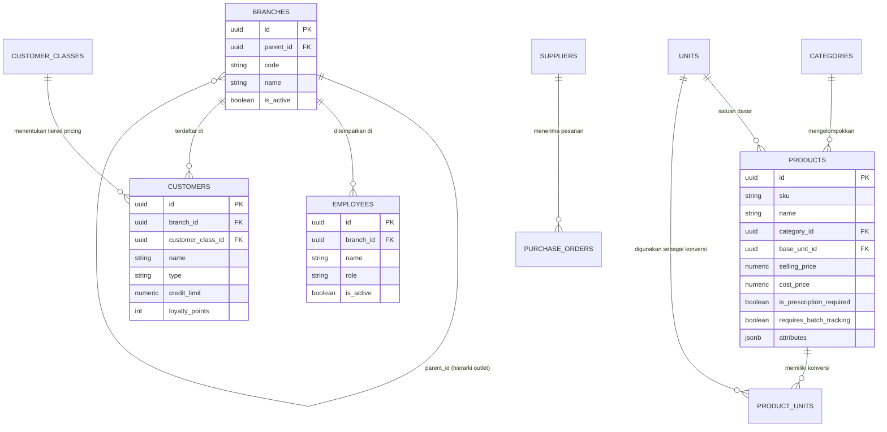
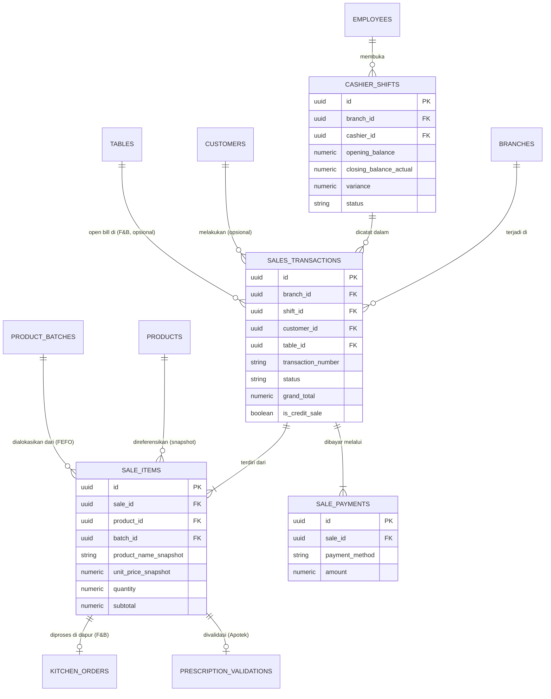
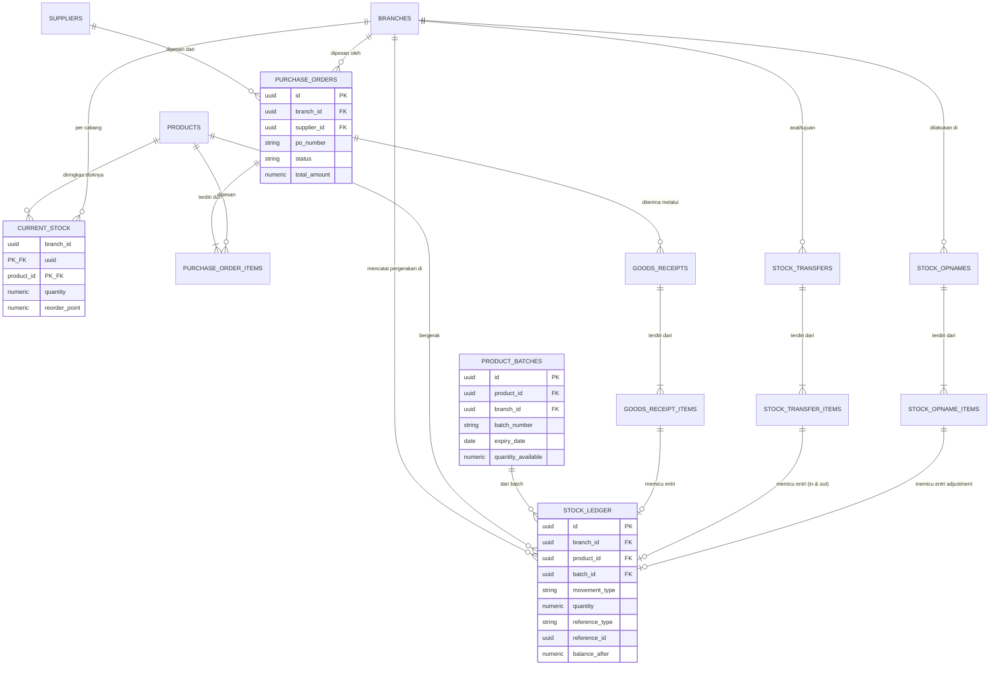
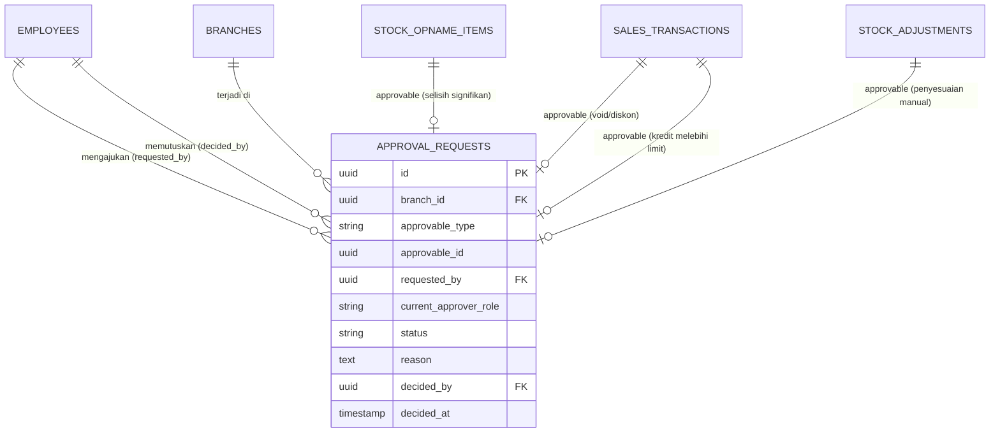
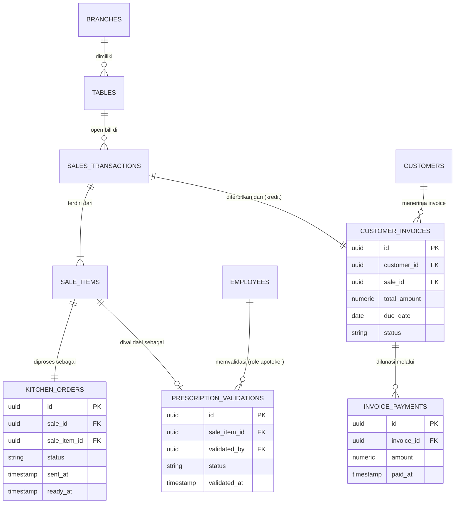
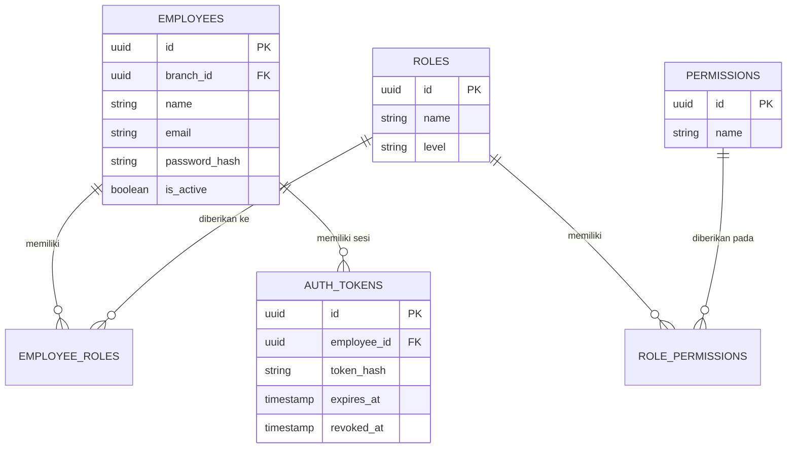

# Entity Relationship Diagram (ERD) — POS

> Dokumen ini menyajikan **visualisasi relasi antar entitas** secara lengkap, melengkapi definisi tabel pada [`database-design.md`](database-design.md). Diagram disajikan dalam notasi Mermaid ER Diagram agar dapat dirender langsung oleh GitHub/GitLab tanpa tools tambahan.

---

## 1. ERD: Master Data

---

## 2. ERD: Modul Sales (Penjualan)

---

## 3. ERD: Modul Inventory & Purchasing

---

## 4. ERD: Modul Approval (Polymorphic)

**Catatan notasi:** Relasi `approvable_type`/`approvable_id` bersifat **polymorphic** — tidak digambarkan sebagai foreign key literal pada database (karena dapat menunjuk ke beberapa tabel berbeda), namun divisualisasikan di sini untuk kejelasan konseptual. Implementasi query harus memfilter berdasarkan `approvable_type` terlebih dahulu, detail pada [`repository-layer-design.md`](repository-layer-design.md).

---

## 5. ERD: Domain Khusus (F&B, Apotek, Distributor)

---

## 6. ERD: Relasi Auth & Access

Detail desain otentikasi dan otorisasi dijelaskan lebih lanjut pada [`authentication-design.md`](authentication-design.md) dan [`authorization-design.md`](authorization-design.md).

---

## 7. Ringkasan Relasi Kunci Lintas Modul

| Relasi | Sifat | Alasan Desain |
|---|---|---|
| `sales_transactions` → `stock_ledger` | Tidak langsung (via `reference_type`/`reference_id`) | Stock ledger bersifat polymorphic terhadap berbagai sumber pergerakan, bukan hanya penjualan |
| `sale_items` → `product_batches` | Opsional (nullable) | Tidak semua produk memerlukan tracking batch (BRULE-ST-02) |
| `approval_requests` → berbagai entitas | Polymorphic | Satu modul Approval melayani banyak jenis aksi tanpa duplikasi struktur (lihat [`module-design.md`](module-design.md#72-desain-generik-polymorphic-approval)) |
| `sales_transactions` → `customer_invoices` | 1-to-1 (khusus transaksi kredit) | Hanya transaksi dengan `is_credit_sale = true` yang menghasilkan invoice |

---

## 8. Traceability

| Aspek ERD | Terkait Dokumen |
|---|---|
| Definisi kolom & tipe data lengkap | [`database-design.md`](database-design.md) |
| Definisi entitas dari sisi bisnis | [`master-data.md`](../business/master-data.md), [`transactions.md`](../business/transactions.md) |
| Implementasi akses data | [`repository-layer-design.md`](repository-layer-design.md) |

---

**Sebelumnya:** [`database-design.md`](database-design.md) — Database Design
**Selanjutnya:** [`api-contract.md`](api-contract.md) — API Contract
